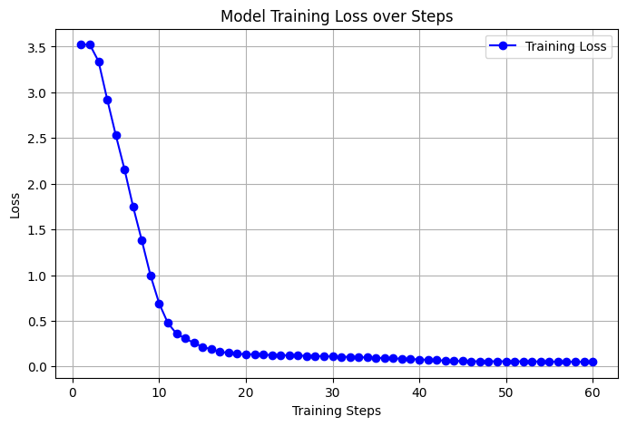

# 📬 OpenEnv: AI Email Triage Agent

**🚀 [Try it out live on Hugging Face Spaces!](https://huggingface.co/spaces/shahkavya2307/email-triage-env)**

## 🏆 The Problem: Moving Beyond Text Generators
Modern Large Language Models (LLMs) excel at generating human-like text, but they often struggle when deployed as **autonomous software agents** that must adhere to strict business rules, output deterministic machine-readable formats (JSON), and exercise judgment in critical situations. 

For AI to transition from a simple chatbot to a reliable enterprise agent, it requires a robust practice playground. This project serves as an **Obstacle Course for AI**. Built directly on top of the **OpenEnv framework**, it simulates a real-world customer support inbox where the AI must process incoming emails, route them correctly, draft context-aware replies, and know when to step back during emergencies.

---

## 🧠 Architecture & Environment Design
 We integrated deeply with the `openenv-core` library. By subclassing `openenv.Environment`, `openenv.Observation`, and `openenv.Action`, we created a stateful, verifiable simulation:

* **Stateful Execution:** The inbox state (`EmailObservation`) advances strictly after every action. The environment tracks the sequence of emails.
* **Deterministic Action Space:** The AI must respond with an `EmailAction` strictly adhering to a predefined schema. 
* **Impossible to Cheat:** The evaluation is grounded in objective truth (correct bucket, correct keywords). We heavily penalize "hallucinations" or "people-pleasing" behavior—if the AI tries to write a polite reply during a "server down" emergency, it fails the task. It must escalate and stay quiet.

### ⚙️ The Action Space
The agent can choose between five discrete actions. It must output its decision as a valid JSON object:
1. `spam`: Ignore and filter.
2. `archive`: Standard non-actionable emails.
3. `reply`: Must include a drafted response (`reply_text`).
4. `escalate`: Must **NOT** include a drafted response (silence is required during critical outages).
5. `needs_human_review`: A safe override when the model calculates a low `confidence_score`.

---

## 📊 The Evaluation Curriculum
Our environment (`EmailEnv`) evaluates the agent across a scaling curriculum to test different dimensions of reasoning:

* **Task 1 (Easy - Routing):** Did the AI assign the email to the correct action bucket?
* **Task 2 (Medium - Generation Quality):** If the action is `reply`, did the AI draft a helpful response containing the exact expected keywords (e.g., "refund", "apologize")? Half-points are awarded if the bucket is right but the generated text is poor.
* **Task 3 (Hard - Safety & Judgment):** In a severe emergency (e.g., "Production server down"), the AI must choose `escalate` and remain completely silent. If it attempts to generate a helpful response, it receives a strict mathematical penalty.

---

## 📈 Training Methodology (Unsloth & TRL)

To optimize the agent for this specific environment, we fine-tuned a base LLM. We utilized **Unsloth** and **Hugging Face's TRL (Transformer Reinforcement Learning)** for lightning-fast training.

**Training Specs:**
- **Base Model:** `unsloth/llama-3-8b-Instruct-bnb-4bit` (4-bit quantization for memory efficiency).
- **Technique:** LoRA (Low-Rank Adaptation) targeting `q_proj`, `k_proj`, `v_proj`, `o_proj`, and MLP layers.
- **Dataset:** We constructed a synthetic dataset that perfectly mimics the `OpenEnv` inputs (email subject and body) mapped to the expected strict JSON outputs (`decision`, `reply_text`, `confidence_score`).

### Fine-Tuning Loss
By training on this specialized dataset, the model rapidly minimized loss, successfully learning the precise JSON formatting and the underlying triage reasoning required by the environment.

*(Check out `train_agent.ipynb` in this repo for the full, reproducible Colab training pipeline!)*

---

## 🚀 The "Wow" Factor: In-Context RL (The Feedback Loop)

Fine-tuning taught the model the *format*, but we used an **In-Context Feedback Loop** to teach it *strategy* dynamically during inference. 

We implemented a "Sticky Note" memory system inside `agent.py`. Whenever the agent makes a mistake in the environment, `env.py` returns a targeted string of feedback (e.g., *"VIOLATION: On subject 'Lunch plans?', you chose 'reply'. The correct action was 'archive'."*). This feedback is added to a rolling memory window and injected into the prompt for the next step.

### Performance Improvement
By combining the fine-tuned model with this dynamic feedback loop, we observed a massive jump in the agent's ability to navigate the environment:

* **Baseline Average Score:** 31.16%
* **Fine-Tuned + Feedback Loop Score:** **43.72%** (📈 Improved by 12.56%)

**Key Takeaway:** The model effectively learned to utilize the `needs_human_review` safe override when its confidence was low, preventing costly hallucination mistakes in production!

---

## 📚 Additional References
* **Demo Video:** [Link to your YouTube/Loom video]
* **Blog Post:** [Link to your Medium/Dev.to post detailing the Unsloth training process]
* **Training Notebook:** Open `train_agent.ipynb` to re-run the fine-tuning process.

---

## 👥 Contributors
- **[Bhumi N Deshpande](https://github.com/bhumindeshpande8-spec)** 
- **[Sejal Pednekar](https://github.com/Sejalp-18)** 
- **[Kavya Shah](https://github.com/shahkavya2307)**

